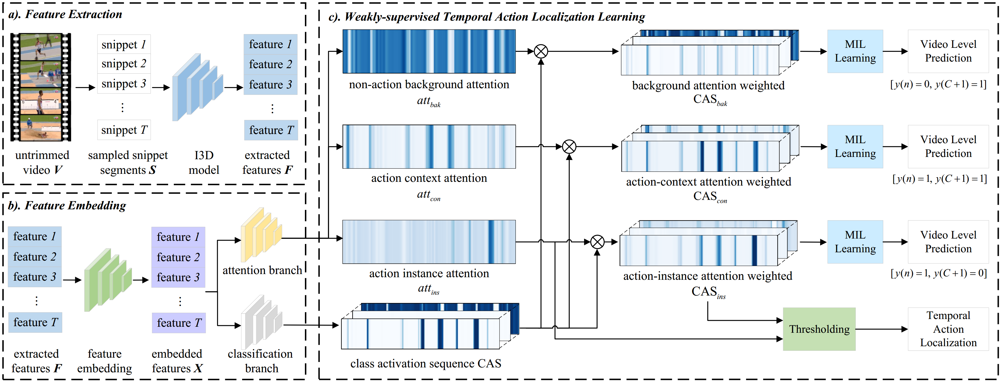

## ACM-Net: Weakly-Supervised-Action-Localization
The  official repository of our paper "**ACM-Net: Action Context Modeling Network for Weakly-Supervised Temporal Action Localization**" .



### Requirements

Required packages are listed in `requirements.txt`. You can install by running:

```bash
pip install -r requirements.txt
```

### Dataset

We evaluate our ACM-Net on two popular benchmark datasets THUMOS-14 and ActivityNet-1.3. We provide extracted features for

- THUMOS-14: [Google Drive](https://drive.google.com/drive/folders/1C4YG01X9IIT1a568wMM8fgm4k4xTC2EQ?usp=sharing) /  [Baidu Wangpan](https://pan.baidu.com/s/1rt8szoDspzJ5SjpcjccFXg) (pwd: vc21)
- ActivityNet-1.3: Google Drive /  [Baidu Wangpan](https://pan.baidu.com/s/1FB4vb8JSBkKqCGD_bqCtYg) (pwd: man7)

Before running the code, please download the target dataset and unzip it under the `data/` folder.

### Running

You can train your own model by running:

```bash
# For the THUMOS-14 datasets.
python main_thu.py

# For the ActivityNet-1.3 datasets.
python main_act.py
```

Note that you can configure your own hyper-parameters in `config/model_config.py` 

To test your model, you can run following command:

```bash
# For the THUMOS-14 datasets.
python main_thu.py --test --checkpoint $checkpoint_path$

# For the ActivityNet-1.3 datasets.
python main_act.py --test --checkpoint $checkpoint_path$
```

### Citation

If you find our code or our paper useful for your research, please cite our work:

```latex
@article{qu_2021_acmnet,
  title={ACM-Net: Action Context Modeling Network forWeakly-Supervised Temporal Action Localization},
  author={Sanqing Qu, Guang Chen, Zhijun Li, Lijun Zhang, Fan Lu, Alois Knoll},
  journal={arXiv preprint arXiv },
  year={2021}
}
```